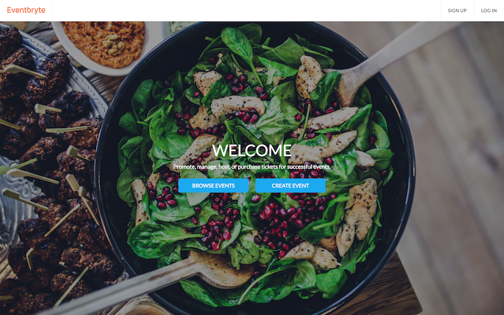
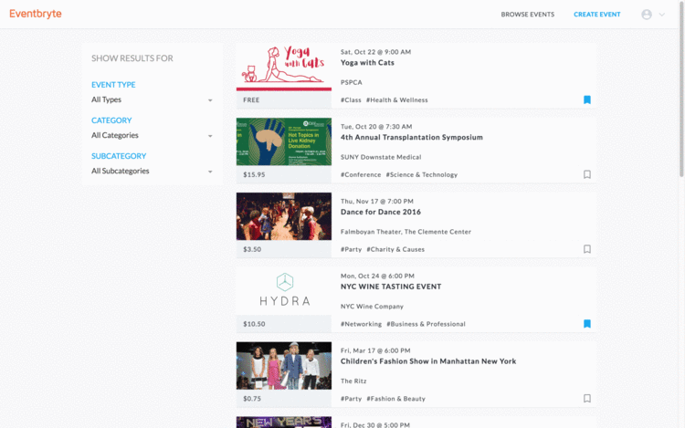

# Eventbryte

[Eventbryte LIVE](http://www.eventbryte.site)

Eventbryte is a full-stack web application inspired by [Eventbrite](http://www.eventbrite.com). It utilizes Ruby on Rails on the backend, a PostgreSQL database, and React.js with a Redux architectural framework on the front end.

## Features & Implementation

### Events

  One of the main features of Eventbryte is CRUD of events. In the database, the events are stored in `events` table which contains `title`, `description`, `organizer_id`, `type_id`, `category_id`, `subcategory_id`, `start_date`, `start_time`, `end_date`, `end_time`, `image_url`, `venue_name`, `place_id`, `address_detail`, `num_tickets`, `ticket_price` columns. Users must be logged in for creating events, but not for browsing events.

  Once the form is submitted with successful AJAX request, the user will be redirected to the event page and will be able to see the event details.

  Event form pages employ two 3rd party APIs. The first one is Google Maps API. The app utilizes its autocomplete and place id feature to improve UX. Once the user enters the address of the venue, it auto-populates all other input fields of the address and it retrieves Google Maps API's `place_id` and uses that information in the database which allows simpler schema.

  

  This app also integrates a remote asset hosting service called [Cloudinary](http://cloudinary.com/) which reduces the server load and improves scalability of the app. The event image is not required. If the user does not provide the image, the default image will be used instead.

### Browse Events

  When user clicks `BROWSE EVENTS` button in the nav bar, the browse event page will show where the user can see all events in the database. On the left side of page is a filter. User can choose a specific type, category, and/or subcategory, and the page will show only events that meet the criteria.

  For example, if a user wants to see only events whose type is `Party` and selects the appropriate type, it will update filters in the store and sends new `GET` AJAX request with the updated filters. Then, the backend will retrieve and sends back only certain events in JSON format.

  

### Bookmarks/Tags/Register
